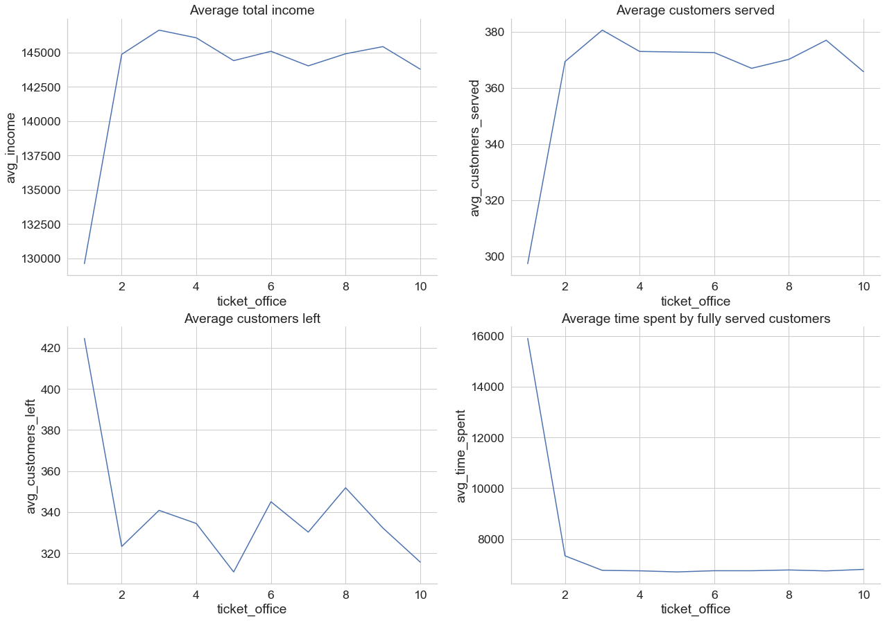

# Ice rink simulational modeling

Code and report for Queueing Theory home assignment.

The task was to think of a queueing system that cannot be descibed in standard queueing theory models and perform a simulation to find some insights of a system.

### System design

Visitors of the skating rink can come with their skates or rent them. Percentage of visitors with their skates β. From this, two scenarios of behavior can be distinguished:
1. Visitor without skates 
- buy a ticket to the skating rink 
- rent skates
- change to skates
- go for a ride
- change your shoes back
- hand over skates

2. Visitor with skates
- buy a ticket to the skating rink
- sharpen skates (optional)
- change skates
- go for a ride
- change your shoes back

Visitors arrive at a constant rate, time of servicing at each stage follow a normal distribution with different mean and standard deviation. These constants and variables are covered in more detail in report and in code.

Income consists of ticket price of 200 rubles and rent price of 300 rubles.

### Problems explored
How 
1. Arrival rate
2. Ice rink capacity
3. Number of ticket offices
4. Number of rent offices
5. Number of skates pairs

affects *income, number of fully served customers, number of gone customers, average time spent in system*?

6. Which capacity of ice rink is the best and the worst for a set of arrival densities?
7. Find ice rink workload during open time with oe set of parameters

### Algorithm

<details>

<summary>Pseudocode</summary>

```python
for sec in [0, time_of_work - 1]: 
    if new customer arrived:
        add new customer in ticket queue 
    if any ticket office is not busy:
            move next customer in ticket queue to ticket office
    if any ticket office is now not busy (current customer’s time
    of ticket servicing is over):
        move customer(s) with ticket to rental or sharpening or to change room
    if customer(s) with ticket has skates:
        with probability α move to sharpening queue
    else:
        move customer to rental queue

    if rental queue is not empty and any rental office is not busy:
        if there are at least one pair of skates: 
            move next customer to rental office
    else:
        customer goes away from ice rink
    if any rental office is now not busy (current customer’s time of rental servicing is over):
        move customer to change room 
    if sharpening is not busy now:
        move next customer to sharpening
    for each customer with ticket and with skates who use rental:
        assign change time in changing room

    for each customer changed in ice skates:
        if ice rink does not have maximum capacity:
            assign skating time
            move to ice rink 
        else:
            customer goes away

    for each customer with expired time on ice: 
        assign change back time
    for each customer changed back:
        if customer has rental skates:
            move to return rent office 
        else:
            customer goes away happy
        if return rent office is not busy now:
            move next customer to return rent office
        if return rent office is now not busy (current customer’s time of return rent servicing is over):
            customer goes away happy
```

</details>

### Results and conclusions

1. The average *income* and the *number of fully served customers* decreases with a decrease in the *arrival rate*, and the rate of decrease is similar. This is due to the fact that the percentage of visitors with skates is constant, which means that these values are almost linearly dependent. Interestingly, the *number of gone customers* and the average time decrease faster than the first two parameters. 
   From the graphs, it can be concluded that with the remaining fixed parameters of the system, *customers almost stop leaving unattended* starting at an intensity of 0.4 people per minute of 1/λ1 ≈ 150.

2. After *ice rink capacity* of 35-40 people, there are almost no changes in the studied parameters. It can be concluded that for arrival rate of 1 person per minute, a skating rink for 35 people is enough.

3. The difference between 2 and 3 *ticket offices* is significant, but with a further increase in their number, the parameters almost do not change.
    The differences in the graphs of the number of fully served customers and gone customers are explained by different total numbers of visitors for individual simulations.

4. Similarly to the previous problem, 2 and 3 *rent offices* differ significantly, then the parameters are approximately the same.

- The optimal parameters for the number of ticket offices and rental are 3.
5. There was a hypothesis that the *number of pairs of skates* at the rental should affect significantly the number of visitors who have gone, since with their small number they will not be enough for everyone.
    Income grows rapidly from 10 to 30 pairs, then remains approximately at the same level, the same with the number of visitors served. This is consistent with the hypothesis above.


1. The optimal (or best) and worst capacities are calculated in terms of income.
The optimal capacity has no explicit dependence on the intensity of the arrival rate. Perhaps this is due to the fact that after a certain capacity, with its further increase, revenue does not change much (as it was in problem 2), and the best income depends on specific simulations, and not on the hyperparameters of the system.

The worst capacity with high arrival rate is small as expected: 10-15 people. Further, with a decrease in arrival rate, most likely the same problem as for optimal capacity.
At arrival rate of 2-0.5 people per minute, the optimal capacity is 80-100 people.


7. Optimal parameters for the arrival rate of 1 person per minute are taken: 3 offices with tickets and rental, 30 pairs of skates, 40 people capacity.
   After the system stabilizes, the workload stays above 22 people on the ice, the maximum is reached only 1 time and only 1 visitor left because of lack of space on ice.


### Further research

In this system other paired dependencies of hyperparameters can be explored, for example, what is the optimal number of ticket offices for the capacity of the rink. One can also change the servicing time constants at the system stages, enter the morning and evening arrival rate, take into account the day of the week and count the monthly income, take into account the cost of maintaining the rink and staff.